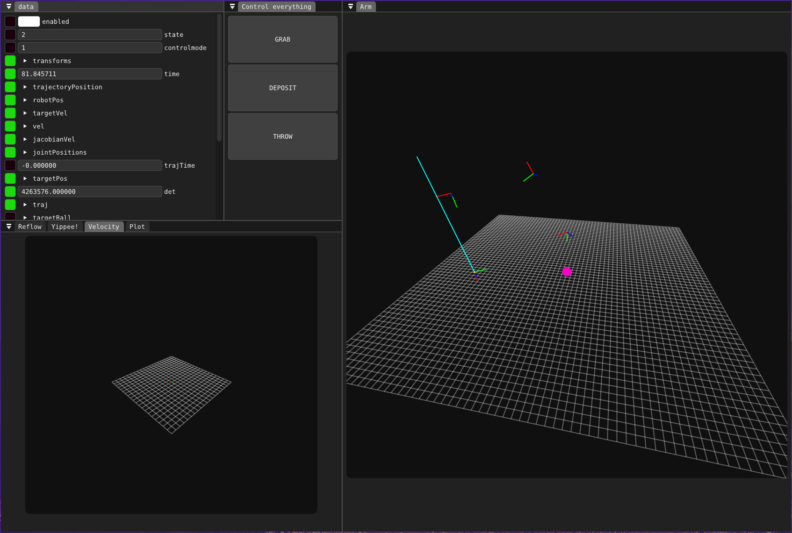

# Telometer
Telometer is a telemetry protocol and dashboard implemented in c++ and zig to enable high speed data transmission across any serial protocol

It is mostly currently being used for my personal projects but I am slowly working to make it usable for any project!

## Current protocols
- UDP
- CAN
- UART
